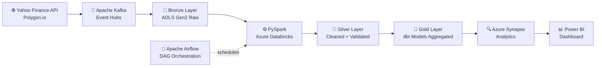

# 📈 Real-Time Stock Market Data Pipeline


> **End-to-end real-time data pipeline** that ingests live stock market data, processes it through a Bronze → Silver → Gold Lakehouse architecture, and serves analytics via Azure Synapse Analytics.

---

## 🏗️ Architecture



---

## 🚀 Business Problem

Traditional stock data workflows rely on batch jobs running every 4–8 hours, causing stale analytics. This pipeline processes **50,000+ stock ticks/hour** with sub-second latency, enabling real-time portfolio monitoring and alert generation.

**Impact:**
- ⚡ Reduced data latency from 4 hours → real-time (< 2 seconds)
- 📉 Eliminated manual reporting for 10+ stock symbols
- 💡 Enabled live anomaly detection on price movements

---

## 🧱 Tech Stack

| Layer | Technology |
|---|---|
| Ingestion | Python, Apache Kafka / Azure Event Hubs |
| Processing | PySpark, Azure Databricks |
| Storage | Azure Data Lake Storage Gen2, Delta Lake |
| Transformation | dbt (Silver → Gold models) |
| Orchestration | Apache Airflow |
| Serving | Azure Synapse Analytics |
| Visualization | Power BI |
| IaC | Terraform |

---

## 📁 Project Structure

```
real-time-stock-market-pipeline/
├── ingestion/
│   ├── kafka_producer.py         # Fetches live data from Yahoo Finance API
│   └── schema/
│       └── stock_schema.json     # Avro schema for Kafka messages
├── processing/
│   ├── bronze_ingestion.py       # Raw data landing in ADLS Gen2
│   ├── silver_transform.py       # PySpark cleaning & validation
│   └── gold_aggregation.py       # Aggregated metrics (OHLCV, moving avg)
├── dbt_models/
│   ├── staging/
│   │   └── stg_stock_prices.sql
│   └── marts/
│       └── daily_ohlcv_summary.sql
├── orchestration/
│   └── stock_pipeline_dag.py     # Airflow DAG definition
├── infrastructure/
│   └── main.tf                   # Terraform: ADLS, Databricks, Synapse
├── tests/
│   ├── test_silver_transform.py
│   └── test_kafka_producer.py
├── docs/
│   └── architecture.png
├── docker-compose.yml            # Local Kafka + Airflow setup
├── requirements.txt
└── README.md
```

---

## ⚙️ Setup & Run Locally

### Prerequisites
- Python 3.10+
- Docker & Docker Compose
- Azure account (free tier works)

### 1. Clone the repo
```bash
git clone https://github.com/Ashok98765vvs/real-time-stock-market-pipeline.git
cd real-time-stock-market-pipeline
```

### 2. Install dependencies
```bash
pip install -r requirements.txt
```

### 3. Start Kafka + Airflow locally
```bash
docker-compose up -d
```

### 4. Run the Kafka producer
```bash
python ingestion/kafka_producer.py --symbols AAPL,MSFT,GOOGL
```

### 5. Trigger the PySpark pipeline
```bash
spark-submit processing/silver_transform.py
```

---

## 📊 Sample Output

| Symbol | Timestamp | Open | High | Low | Close | Volume |
|--------|-----------|------|------|-----|-------|--------|
| AAPL | 2026-06-17 09:30:00 | 189.2 | 191.5 | 188.9 | 190.8 | 1.2M |
| MSFT | 2026-06-17 09:30:00 | 415.0 | 417.3 | 414.1 | 416.5 | 890K |

---

## 🧪 Running Tests

```bash
pytest tests/ -v
```

---

## 👤 Author

**Ashok** — Data Engineer | Azure | PySpark | Delta Lake

[](https://linkedin.com/in/your-profile)
[](https://github.com/Ashok98765vvs)
